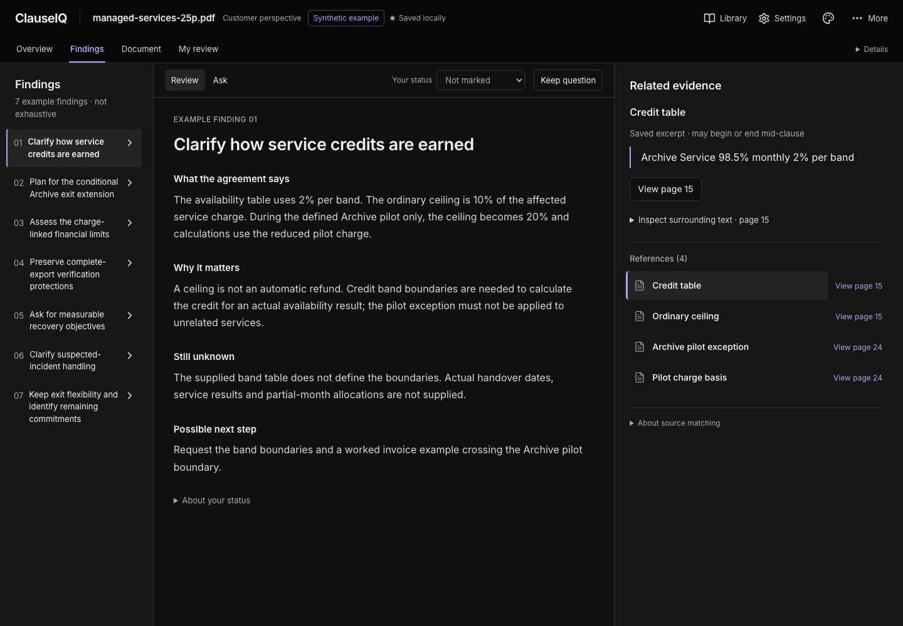

# ClauseIQ

A local contract-review workspace that keeps the agreement, its findings and your
questions together. Import a PDF, inspect evidence in the original document, and
turn the review into a short list of questions to raise.

*Actual application UI with the authored synthetic example—not AI-generated output.
[Reproduce this walkthrough](docs/WALKTHROUGH.md).*

ClauseIQ runs as one personal workspace: no accounts or administrator setup.
Importing, reading, saving questions and exporting your review are local actions.
AI reviews and follow-up answers use your own OpenAI key, only when explicitly
requested. There is no application-funded service or supported hosted deployment.

> Experimental engineering project, not legal advice. AI can miss material terms
> or misinterpret them. A matched citation locates source wording; it does not
> establish correctness or a complete review.

## The workflow

1. **Import an agreement.** Keep the original PDF and page-aware extracted text;
   inspect missing-text limitations before reviewing.
2. **Review with evidence.** Choose your perspective, then explicitly generate a
   summary and findings. Preview an excerpt beside its finding and open its
   physical PDF page.
3. **Ask and decide.** Ask a finding-grounded follow-up, keep your own question,
   or mark a finding to revisit. Drafts, AI answers and confirmed questions stay
   separate.
4. **Take your work with you.** Resume your reading position and export confirmed
   questions and markers as a Markdown review brief.

The reading workspace offers Black and Graphite themes. Settings exposes the
application's GPT-6 Luna, Sol and Astra catalog with configurable reasoning effort;
Sol/Medium is the default. Changing a model or instructions never reruns a review
or rewrites an earlier result.

**Try it without an API key:** import the reviewed
[25-page synthetic agreement](tests/fixtures/pdfs/managed-services-25p.pdf) and
load its labelled, authored example. Follow the
[short walkthrough](docs/WALKTHROUGH.md); the example is not live AI output.

## Run locally

Prerequisites: Node.js 24+, Python 3.13+, Docker with Docker Compose. An OpenAI API
key is needed only for AI operations.

Before starting, check whether ClauseIQ already uses ports 3000, 8000, 27017,
6333 and 6334. **Existing installation?** Keep its environment files, database
selection and credential directory. Read
[workspace continuity](docs/DEVELOPMENT.md#existing-workspace-continuity) and
[Qdrant data guidance](DOCKER.md#qdrant-versions-and-existing-stores) before changing
storage or recreating containers.

~~~bash
cp -n backend/.env.example backend/.env
cp -n frontend/.env.example frontend/.env.local
npm ci
npm run setup
docker compose -f docker-compose.dev.yml up -d
npm run dev
~~~

Open [localhost:3000](http://localhost:3000). Add your key in Settings when needed;
no JWT, SMTP or account configuration is required. The API and its generated docs
are at [localhost:8000/docs](http://localhost:8000/docs). Keep all services on
loopback; do not expose this unauthenticated local workspace through a public tunnel.

Documents stay until deleted unless you deliberately enable retention. Saved
reviews remain readable without a key. Local storage does not mean offline AI:
explicit AI requests send document content to OpenAI.

## Engineering

Next.js 15, React 19 and TypeScript on the frontend; FastAPI and Python on the
backend; MongoDB/GridFS for workspace data and originals; Qdrant for retained
document-chat retrieval. PDF reading uses locally served Mozilla PDF.js assets,
not a viewer CDN.

The implementation separates immutable source/review snapshots from revisioned
personal work. Review-workspace generation and Ask have explicit dispatch, bounded
input/output, persisted attempt identities and no automatic retries. Source
matching and deterministic tests check engineering contracts, not legal quality.
See [Evaluation](docs/EVALUATION.md) for the existing synthetic cases, assessment
method and the distinction between reference matching and supported conclusions.

~~~bash
npm test           # deterministic backend and frontend tests; no paid AI
npm run typecheck
npm run lint
npm run check      # complete checkpoint, including the production build
~~~

Use focused checks during development; batch broader browser checks and builds at
meaningful checkpoints. See [Development](docs/DEVELOPMENT.md) for commands,
isolated storage checks and separately approved live evaluations.

[CI](.github/workflows/ci.yml) checks backend/frontend tests, types, lint, a
production build, mocked and real-stack synthetic Chromium journeys, backend
branch coverage and reachable-history secret scanning.
It needs no AI key and does not deploy the application.

## More information

- [Walkthrough](docs/WALKTHROUGH.md) — a reproducible, key-free product tour
- [Architecture](docs/ARCHITECTURE.md) — services, source identity and state boundaries
- [API reference](docs/API_REFERENCE.md) — local access and endpoint contracts
- [Security](docs/SECURITY.md) — credentials, backups and supported trust boundary
- [Contributing](docs/CONTRIBUTING.md) and [repository policy](docs/REPOSITORY_POLICY.md)
- [Docker](DOCKER.md) — infrastructure and isolated container checks

## License

[MIT](LICENSE). Third-party dependencies retain their own licenses; PDF.js is
Apache-2.0 and its generated assets retain the upstream notices.
